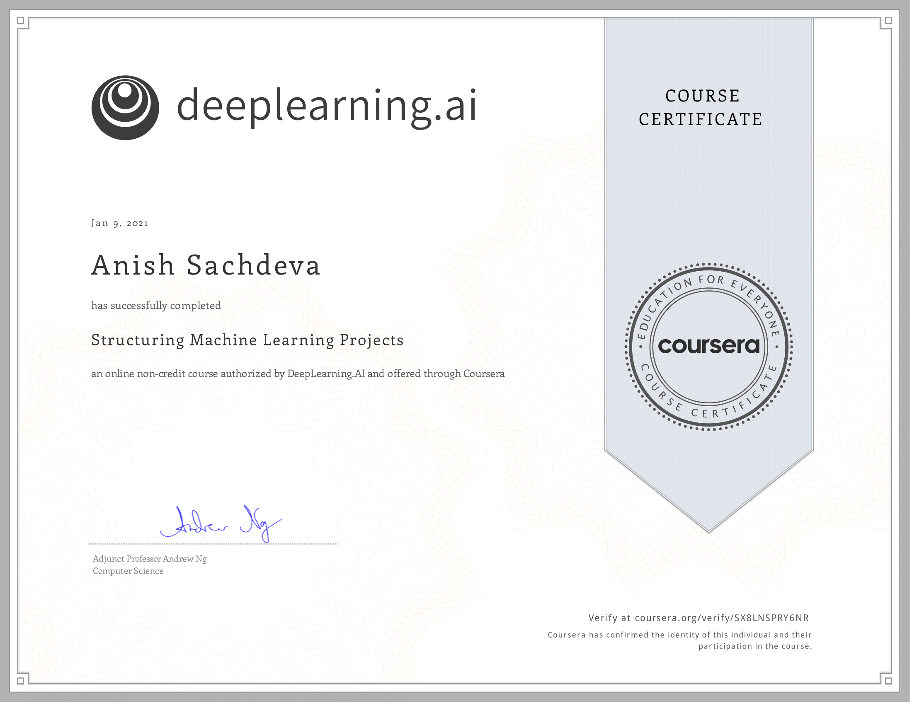

# Structuring Machine Learning Projects @Coursera

__Course by deeplearning.ai__

This is part of the 5 course specialization on 
[Deep Learning](https://github.com/anishLearnsToCode/deep-learning-ai) 
on Coursera. This is the third course.

## 📖 Overview
- [Week 1](#week-1)
- [Week 2](#week-2)
- [Certificate](#-certificate)

## Week 1
- [Quiz: Bird Recognition in The City Of Peacetopia Case Study](week_1/quiz-bird-recognition.md)

## Week 2
- [Quiz: Autonomous Driving (Case Study)](week_2/quiz-autonomous-driving.md)

## 🎓 [Certificate](https://coursera.org/verify/SX8LNSPRY6NR)

